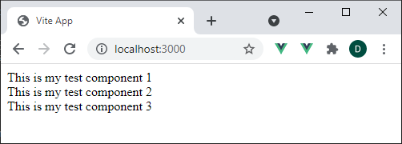
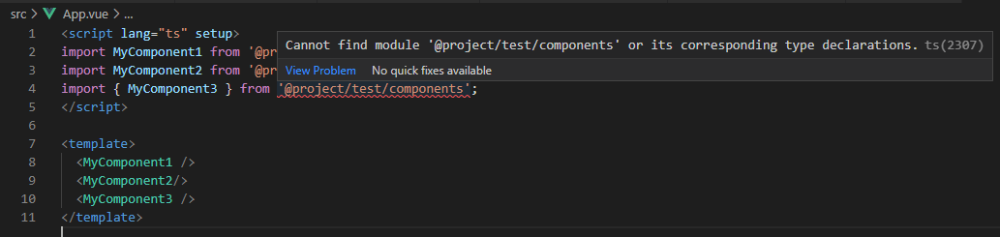

# Test for typescript and export field from package.json for volar

## Prerequisites

- Yarn - This package uses yarn workspaces

## Getting started

```bash
git clone https://github.com/cimchd/ts-exports.git
cd ts-exports
yarn install
yarn build
yarn dev
```

## Test package

This project provides the private npm package `@project/test`, defined under `/packages/test`, configured as a yarn workspace package.

## Browser output

To see that all three imports in `App.vue` are working, this should be the browser output:



And this is the error message in vscode:



Interesting, that it seems like the first two imports are detected correctly. This seems to be an error, because volar still does not show an error if the two export entries for the dist folder are removed.
